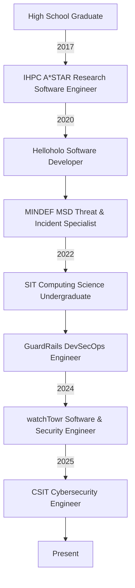

Hi there! I'm Aaron, a software developer.

<i>I'm open for hire! :eyes:</i>

```mermaid
flowchart TD
Start[High School Graduate] -- 2017 --> Emp1[IHPC A*STAR Research Software Engineer]
Emp1 -- 2020 --> Emp2[Helloholo Software Developer]
Emp2 --> Emp3[MINDEF MSD Threat & Incident Specialist]
Emp3 -- 2022 --> Uni[SIT Computing Science Undergraduate]
Uni --> Emp4[GuardRails DevSecOps Engineer]
Emp4 -- 2024 --> Emp5[watchTowr Software & Security Engineer]
Emp5 -- 2025 --> Emp6[CSIT Cybersecurity Engineer]
Emp6 --> End[Present]

click Emp1 "https://github.com/mcdulltii/Resume/blob/master/resume.md#research-software-engineer-at-institute-of-high-performance-computing-ihpc-astar-2017----2018" _blank
click Emp2 "https://github.com/mcdulltii/Resume/blob/master/resume.md#software-developer-at-helloholo-2020----2021" _blank
click Emp3 "https://github.com/mcdulltii/Resume/blob/master/resume.md#threat-and-incident-specialist-at-mindef---military-security-department-msd-2020----2022" _blank
click Emp4 "https://github.com/mcdulltii/Resume/blob/master/resume.md#devsecops-engineer-at-guardrails-2022" _blank
click Emp5 "https://github.com/mcdulltii/Resume/blob/master/resume.md#software--security-engineer-at-watchtowr-2024" _blank
click Emp6 "https://github.com/mcdulltii/Resume/blob/master/resume.md#cybersecurity-engineer-at-centre-for-strategic-infocomm-technologies-csit-2024----2025" _blank
```

## ⚡ Stats

