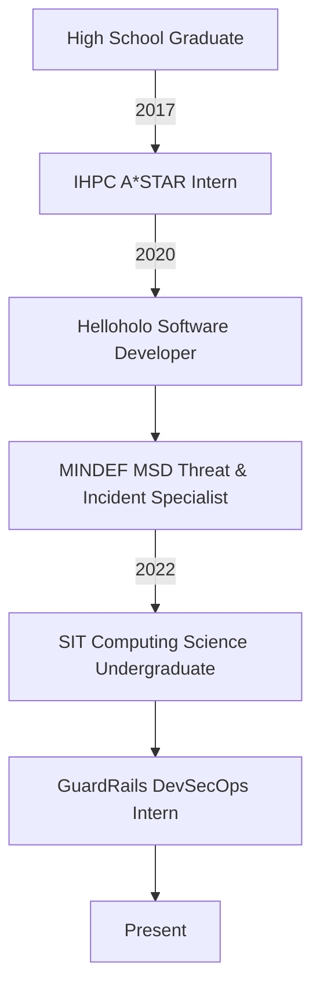

Hi there! I'm Aaron, a software developer.

<i>I'm open for hire! :eyes:</i>

```mermaid
flowchart TD
Start[High School Graduate] -- 2017 --> Emp1[IHPC A*STAR Intern] 
Emp1 -- 2020 --> Emp2[Helloholo Software Developer]
Emp2 --> Emp3[MINDEF MSD Threat & Incident Specialist]
Emp3 -- 2022 --> Uni[SIT Computing Science Undergraduate]
Uni --> Emp4[GuardRails DevSecOps Intern]
Emp4 --> End[Present]

click Emp1 "https://github.com/mcdulltii/Resume/blob/master/resume.md#intern-at-institute-of-high-performance-computing-ihpc-astar-may-2017----jan-2018" _blank
click Emp2 "https://github.com/mcdulltii/Resume/blob/master/resume.md#software-developer-at-helloholo-nov-2020----jan-2021" _blank
click Emp3 "https://github.com/mcdulltii/Resume/blob/master/resume.md#threat-and-incident-specialist-at-mindef---military-security-department-msd-apr-2020----apr-2022" _blank
click Emp4 "https://github.com/mcdulltii/Resume/blob/master/resume.md#devsecops-intern-at-guardrails-oct-2022---dec-2022" _blank
```

## ⚡ Stats

